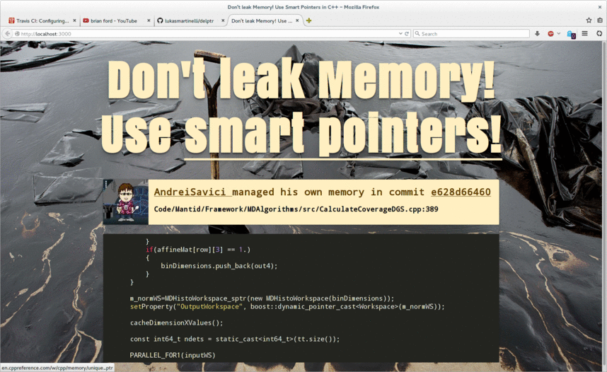

# delptr [](https://travis-ci.org/lukasmartinelli/delptr)  [](https://codeclimate.com/github/lukasmartinelli/delptr) [](https://coveralls.io/r/lukasmartinelli/delptr?branch=master) [](https://gemnasium.com/lukasmartinelli/delptr)

[](http://drone.dreicloud.ch/github.com/lukasmartinelli/delptr)

Listen to all push events of C++ projects on Github and run some simple linting, to check
whether the people still manage memory on their own instead of using smart pointers.

If someone still uses `new` and `delete` in their code they appear in realtime on the
site.



## Install

Clone the repository and install the dependencies with Node.

```
npm install
```

## Run

Run the server with an optional Github access token.
Please be aware that this will download alot of data if you don't provide
a Github access token.

```
export GITHUB_TOKEN="asb1234gwa..."
export GHRR_URI="http://ghrr.gq:80/events"
npm start
```

Now you can visit `localhost:3000` to see the realtime linting in action.

## Build

You need gulp to run the tests.

```
npm install -g gulp
```

Now you can execute the tests and lint the project.

```
gulp
```

## Todos

- [ ] Store logs in a database (2h)
- [ ] Replay 5 latest leaks (1h)
- [ ] Fix memory leaks in Node application itself (4h)
- [ ] Rigorous testing (1h)
